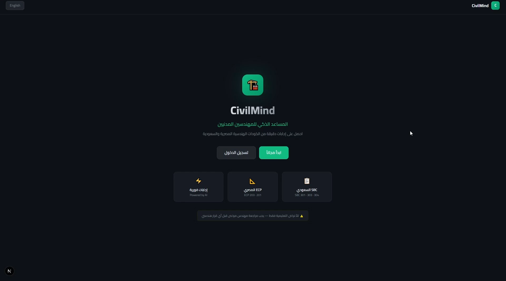
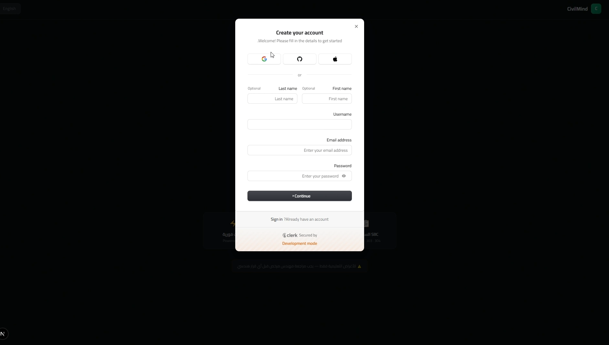

# 🏗️ CivilMind

<div align="center">

**Bilingual AI Assistant (Arabic/English) for Egyptian ECP & Saudi SBC Engineering Codes**


</div>

---

## 🎯 Problem

Civil engineers spend hours manually searching through hundreds of pages of Egyptian (ECP) and Saudi (SBC) engineering standards to find specific code requirements. No existing tool understands engineering context or supports Arabic-language queries.

## 💡 Solution

CivilMind is a bilingual RAG-powered AI assistant. Engineers ask questions in Arabic or English and get accurate, sourced answers from engineering codes instantly — with the original source reference included in every response.

---

## 🎬 Demo

### Login & Quick Questions
https://github.com/Abdelrahman-Nashaat/civil_mind/blob/main/docs/videos/demo-login.mp4

### Q&A Demo
https://github.com/Abdelrahman-Nashaat/civil_mind/blob/main/docs/videos/demo-qa.mp4

---

## 🖼️ Screenshots

| Arabic Query | English Query |
|---|---|
|  |  |

---

## 🏗️ Architecture


```
User
 ↓
Next.js 14  ←→  Clerk (Gmail Auth)
 ↓
n8n (Webhook Orchestration)
 ↓
Dify (RAG Engine + Knowledge Base)  →  Langfuse (Monitoring)
 ↓              ↓                ↓
Ollama      Upstash Redis    ECP + SBC
(Embeddings) (Session Memory) (Knowledge Base)
```

---

## 🛠️ Tech Stack

| Layer | Technology | Purpose |
|-------|-----------|---------|
| Frontend | Next.js 14 + TypeScript | UI + Arabic RTL support |
| Auth | Clerk | Gmail / email authentication |
| Orchestration | n8n | Webhook handling + RAG routing |
| RAG Engine | Dify | Knowledge base + LLM calls |
| Embeddings | Ollama (nomic-embed-text) | Arabic + English embeddings locally |
| Memory | Upstash Redis | Conversation session history |
| Monitoring | Langfuse | Tracing + cost tracking |
| OCR | Gemini Vision API | Scanned PDF text extraction |

---

## ✨ Features

- 🌐 **Bilingual UI** — Full Arabic RTL + English LTR, switchable at runtime
- 📚 **Engineering RAG** — ECP (Egyptian) + SBC (Saudi) standards: SBC 201, 301, 303, 304 / ECP 201, 203
- 🔍 **Source citations** — Every answer includes the exact source reference
- 💾 **Session memory** — Remembers conversation context per user session
- 🔐 **Authentication** — Gmail login via Clerk, route-level middleware protection
- 📊 **Full observability** — Langfuse tracing for every request
- ⚡ **Quick questions** — Pre-built engineering question shortcuts on the landing page
- ⚠️ **Disclaimer** — Built-in engineering disclaimer (educational use only)

---

## 🔧 Key Technical Challenges Solved

### 1. Scanned PDF Processing
Engineering standards were scanned image PDFs — not searchable text. Standard text extractors returned empty output.

**Solution:** Built a Gemini Vision OCR pipeline (`knowledge script/civilmind_knowledge/gemini OCR pipeline/ocr_scanned_pdfs.py`) that processes each page as an image and extracts Arabic and English text before indexing into Dify.

### 2. Arabic Embedding Support
All major cloud embedding providers (OpenAI, Cohere) had poor support for Arabic text — embeddings were semantically wrong, causing irrelevant retrieval results.

**Solution:** Deployed Ollama locally with `nomic-embed-text` which handles bilingual Arabic/English content effectively. This also removed external API costs for the embedding layer.

### 3. n8n HeadersTimeoutError
Using Next.js's default `fetch()` to call the n8n webhook caused a `HeadersTimeoutError` due to how n8n handles chunked transfer encoding responses.

**Solution:** Replaced `fetch()` with Node.js native `http.request()` module in the API route, which correctly handles the response without timing out. The fix also sets `Accept-Encoding: identity` to prevent compression issues.

```js
// app/api/chat/route.js
const { default: http } = await import('http')
const req = http.request({
  hostname: '127.0.0.1',
  port: 5678,
  path: '/webhook/civil-assistant',
  method: 'POST',
  headers: {
    'Content-Type': 'application/json',
    'Content-Length': Buffer.byteLength(body),
    'Accept-Encoding': 'identity',
  },
}, ...)
```

### 4. n8n Workflow Node Order
The n8n workflow was returning empty responses silently. No errors shown.

**Root cause:** `Set Memory` node was placed before `Respond to Webhook`. n8n requires the webhook response to be sent first before any further processing — reversing the order caused the response to never reach Next.js.

**Solution:** Moved `Respond to Webhook` to execute before `Set Memory` in the workflow.

### 5. Country-Aware Routing
The same knowledge base contains both Egyptian (ECP) and Saudi (SBC) standards. Without routing, the LLM would mix up standards from different countries.

**Solution:** The frontend passes a `country` parameter (`eg` or `sa`) with each question. The API route prepends a context label to every query:

```js
const body = JSON.stringify({
  question: `[${country === 'sa' ? 'السعودية - SBC' : 'مصر - ECP'}] ${question}`,
  user_id: userId,
})
```

---

## 🚀 Local Setup

### Prerequisites
- Node.js 18+
- Docker Desktop (for n8n and Dify)
- Ollama installed locally

### 1. Clone and install

```bash
git clone https://github.com/Abdelrahman-Nashaat/civil_mind.git
cd civil_mind
cd "node js/civilmind"
npm install
```

### 2. Environment variables

```bash
cp .env.local.example .env.local
# Edit .env.local with your actual API keys
```

### 3. Start services

```bash
# Pull the embedding model
ollama pull nomic-embed-text

# Start n8n
docker run -it --rm -p 5678:5678 -v n8n_data:/home/node/.n8n n8nio/n8n

# Start Dify (follow Dify's official Docker Compose setup)
# https://docs.dify.ai/getting-started/install-self-hosted/docker-compose
```

### 4. Import n8n workflow

1. Open n8n at `localhost:5678`
2. Go to **Workflows → Import**
3. Import `n8n-workflows/My workflow.json`
4. Add your credentials (Groq API key, Upstash Redis, Langfuse)
5. Activate the workflow

### 5. Import Dify knowledge base

1. Open Dify and create a new knowledge base
2. Upload the processed text files from `knowledge script/civilmind_knowledge/`
3. Configure the RAG app using `json export/Knowledge Retreival + Chatbot.yml`

### 6. Start the app

```bash
npm run dev
# Open http://localhost:3000
```

---

## 📂 Project Structure

```
civil_mind/
├── node js/civilmind/          # Next.js 14 frontend
│   ├── app/
│   │   ├── api/chat/route.js   # API route → n8n webhook
│   │   ├── chat/page.js        # Main chat interface
│   │   ├── sign-in/            # Clerk auth pages
│   │   └── page.js             # Landing page (bilingual)
│   ├── middleware.js            # Clerk route protection
│   └── .env.local.example      # Environment variables template
├── n8n-workflows/
│   └── My workflow.json        # n8n workflow export
├── json export/
│   └── Knowledge Retreival + Chatbot.yml  # Dify app config
├── knowledge script/
│   └── civilmind_knowledge/
│       ├── SBC_201_AR.txt      # Saudi Building Code (Arabic)
│       ├── SBC_301.txt
│       ├── SBC_303.txt
│       ├── SBC_304.txt
│       ├── ocr_scanned_pdfs.py # OCR extraction script
│       └── gemini OCR pipeline/
│           └── ocr_scanned_pdfs.py
├── civilMind PDF/
│   ├── EGYPT/                  # ECP source document links
│   └── SA/                     # SBC source document links
├── docs/
│   ├── screenshots/            # UI screenshots + architecture diagram
│   └── videos/                 # Demo recordings
└── README.md
```

---

## ⚠️ Note on Deployment

This project runs fully locally. Public deployment was paused due to licensing restrictions on the official ECP and SBC engineering standards documents. The full architecture, source code, n8n workflows, Dify configuration, and OCR pipeline are available here to demonstrate the technical implementation.

---

## 👨‍💻 Author

**Abdelrahman Nashaat** — AI/GenAI Engineer

- 🐙 GitHub: [Abdelrahman-Nashaat](https://github.com/Abdelrahman-Nashaat)
- 🎓 Databricks Generative AI Engineer Certified

---

## 📄 License

This repository contains original code (MIT licensed). The engineering standards documents (ECP/SBC) referenced are subject to their respective copyright holders and are not included in this repository.
